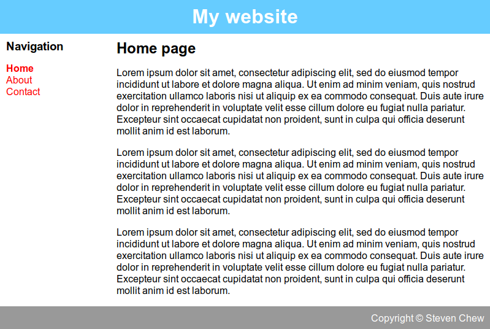

## Project Management, Web Development & Version Control
1. Project Management Principles
   * [Triage](https://jeffschwisow.com/how-triage-will-keep-your-projects-from-killing-you-2/): critical, serious, dying
   * Demand- vs supply-side time management
   * [Serial vs parallel development](https://medium.com/ucsddesignco/iterative-vs-parallel-prototyping-575d455da5b5)
   * [Spiral development](https://en.wikipedia.org/wiki/Spiral_model)
   * [Bottom-up vs top-down approach](https://techdifferences.com/difference-between-top-down-and-bottom-up-approach.html)
   * [Hierarchy](https://www.hierarchystructure.com/what-is-project-hierarchy/), [modularity](https://en.wikipedia.org/wiki/Modularity)
   * Document as you work
   * [Mythical man-month](https://en.wikipedia.org/wiki/The_Mythical_Man-Month)
2. Project Management Software
   - [TaskJuggler](https://taskjuggler.org/)
   - [OpenProj](https://sourceforge.net/projects/openproj/)
   - [GanttProject](https://sourceforge.net/projects/openproj/)
   - [Trello](https://trello.com/stevenchew17/boards)
2. Web Development
   * [HTML, CSS, JavaScript](https://blog.hubspot.com/marketing/web-design-html-css-javascript)
   * [W3 Schools](https://www.w3schools.com/)
   * [Mozilla Developer Network](https://developer.mozilla.org/en-US/)
   * [Learn HTML in 12 mins](https://www.youtube.com/watch?v=bWPMSSsVdPk)
   * [Learn More HTML in 12 mins](https://www.youtube.com/watch?v=KJ13lX20FqU)
   * [Learn CSS in 12 mins](https://www.youtube.com/watch?v=0afZj1G0BIE)
   * [Learn CSS in 20 min](https://www.youtube.com/watch?v=1PnVor36_40)
   * [Learn JavaScript in 12 mins](https://www.youtube.com/watch?v=Ukg_U3CnJWI)
   * [HTML5 cheatsheet](https://htmlcheatsheet.com/), [HTML5 cheatsheet](https://developer.mozilla.org/en-US/docs/Learn/HTML/Cheatsheet), [HTML5 cheatsheet (pdf)](https://html.com/wp-content/uploads/html-cheat-sheet.pdf)
   * [JavaScript cheatsheet](https://websitesetup.org/javascript-cheat-sheet/), [JavaScript cheatsheet](https://htmlcheatsheet.com/js/)
   * [CSS cheatsheet](https://websitesetup.org/css3-cheat-sheet/), [CSS cheatsheet](https://htmlcheatsheet.com/css/), [CSS cheatsheet](http://www.cheat-sheets.org/sites/css.su/)
   * [CSS Zen Garden](http://www.csszengarden.com/)
3. Web Editors
   * [Atom](https://atom.io/), [Brackets](http://brackets.io/)
   * [Visual Studio Code](https://code.visualstudio.com/)
   * [SublimeText](https://www.sublimetext.com/)
   * [Notepad++](https://notepad-plus-plus.org/)
   * [Markdown](https://guides.github.com/features/mastering-markdown/)
     - Windows: [Markdown Monster](https://markdownmonster.west-wind.com/), [ghostwriter](https://wereturtle.github.io/ghostwriter/)
     - Mac: [MacDown](https://macdown.uranusjr.com/)
     - Linux: [ghostwriter](https://wereturtle.github.io/ghostwriter/)
     - Online: [StackEdit](https://stackedit.io/), [Dillinger](https://dillinger.io/)
4. Version Control
   * [CVS](https://www.nongnu.org/cvs/), [Subversion](http://subversion.apache.org/), [Mercurial](https://www.mercurial-scm.org/)
   * [GitHub](https://github.com/)
     - [Signing up for an account](https://help.github.com/en/github/getting-started-with-github/signing-up-for-a-new-github-account)
     - [Quick Start](https://help.github.com/en/github/getting-started-with-github/quickstart)
     - [Creating a repository](https://help.github.com/en/github/getting-started-with-github/create-a-repo)
   * [Git](https://www.freecodecamp.org/news/what-is-git-and-how-to-use-it-c341b049ae61/)
   * [Git in 15 mins](https://www.youtube.com/watch?v=USjZcfj8yxE)
   * [Git in 20 mins](https://www.youtube.com/watch?v=IHaTbJPdB-s)
   * [Learn Basics of Git](https://www.freecodecamp.org/news/learn-the-basics-of-git-in-under-10-minutes-da548267cc91/)
   * [Intro to Git](https://product.hubspot.com/blog/git-and-github-tutorial-for-beginners)
   * [Pro Git](https://git-scm.com/book/en/v2)
   * [Git cheatsheet](https://github.github.com/training-kit/downloads/github-git-cheat-sheet.pdf)
5. Blogs, Wikis and Content Management Systems
   * [GitBook](https://www.gitbook.com/)
   * [DokuWiki](https://www.dokuwiki.org/dokuwiki)
     - [DokuWiki manual](https://www.dokuwiki.org/manual)
     - [DokuWiki Tutorial](https://www.youtube.com/playlist?list=PLRbr75d0SxpdC-Xe844r_afMtLZrUQ1Eg)
     - [Create a Website like Wikipediai](https://www.youtube.com/watch?v=I7L6_E4YTRA) 
   * [WordPress](https://wordpress.com/)
     -[WordPress Quick Start Guide](https://wordpress.com/learn/courses/getting-started/quick-start-guide/)
     - [WordPress Tutorial for Beginners](https://www.youtube.com/watch?v=kYY88h5J86A)
     - [Build a WordPress Website in 10 minutes](https://www.youtube.com/watch?v=cVcaJB5vU7s)
     - [WordPress Website Tutorial Step-by-Step](https://www.youtube.com/watch?v=LMVEzg82pnU) 
   * [Drupal](https://www.drupal.org/home)
   * [Moodle](https://moodle.org/)
   * [Wix](https://www.wix.com/)
     - [Wix Tutorial for Beginners](https://www.tooltester.com/en/blog/wix-tutorial/)
     - [Step-by-Step Beginner Tutorial](https://www.youtube.com/watch?v=YxpjW-Mq96Q)
     - [Blog Tutorial](https://www.youtube.com/watch?v=esvR6Es3Uag&t=205s)
     - [Build Your Website with Wix Editor](https://www.wix.com/learn/courses/web-design/build-your-website-with-the-wix-editor) 
   * [Blogger](https://www.blogger.com/about/)

### Assignment
   - Create a personal website containing as a minimum:
      - header section
      - main section
      - footer section
      - navigation bar (top or sidebar)
      - home page (what this website is all about)
      - about page (some information about yourself)
      - signed student agreement
      - contact page
      - separate pages for each topic
   - Document the process/method used to create your personal website

   
    
   [Sample Website Template (zipped)](resources/website-template.zip)

   
