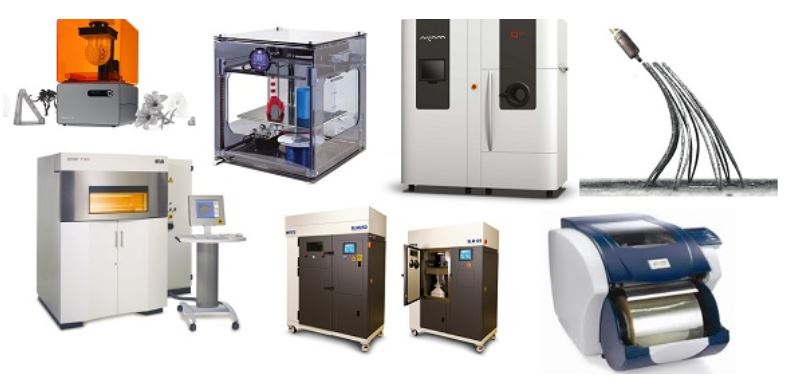
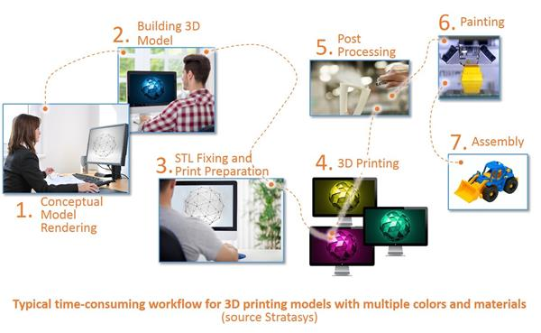
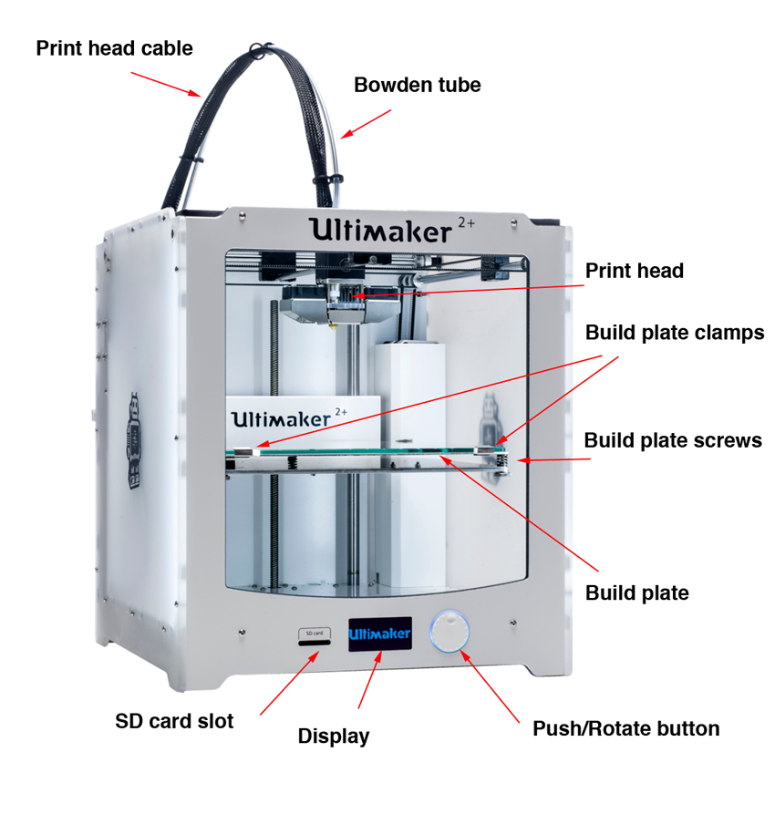
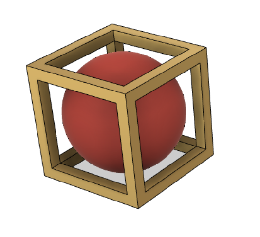

# 3D Printing
### [Fablab 3D Printing notes](https://esp.sp.edu.sg/webapps/blackboard/content/listContent.jsp?course_id=_51997_1&content_id=_1826847_1)

### [Manufacturing Processes](https://en.wikipedia.org/wiki/List_of_manufacturing_processes)
* [Additive vs Subtractive](https://all3dp.com/2/additive-vs-subtractive-manufacturing-simply-explained/)
* [Cutting](https://en.wikipedia.org/wiki/Cutting)
* [Forming](https://www.corrosionpedia.com/definition/4700/forming)

### [Motivations/Advantages](https://www.3dhubs.com/knowledge-base/advantages-3d-printing/)
* Design freedom
* Faster production
* Customization
* Less waste
* many others

### 3D Printing Hall of Fame
* [Chuck Hull](http://www.cnn.com/2014/02/13/tech/innovation/the-night-i-invented-3d-printing-chuck-hall/), [3D Systems](https://www.3dsystems.com/)
* [Scott Crump](https://www.computerhope.com/people/s_scott_crump.htm), [Stratasys](https://www.stratasys.com/)
* [Adrian Bowyer](https://reprap.org/wiki/About), [RepRap](https://reprap.org/wiki/RepRap)

### [Materials](https://www.allthat3d.com/3d-printer-filament/)
* [PLA](https://www.simplify3d.com/support/materials-guide/pla/)
* [ABS](https://www.simplify3d.com/support/materials-guide/abs/)
* [PETG](https://www.simplify3d.com/support/materials-guide/petg/)
* [Nylon](https://www.simplify3d.com/support/materials-guide/nylon/)
* [TPU](https://www.simplify3d.com/support/materials-guide/flexible/)
* HIPS
* glass
* ceramic
* carbon fiber
* metals: aluminum, steel, titanium, etc
* Food
* concrete

[Simplify3D materials guide](https://www.simplify3d.com/support/materials-guide/) 
[Materials comparison chart](https://www.simplify3d.com/support/materials-guide/properties-table/)

### [Constraints](http://www.3dbenchy.com/)
* [failure](http://academy.cba.mit.edu/classes/scanning_printing/fail.jpg)
* [layer height](https://all3dp.com/2/3d-printer-layer-height-how-much-does-it-matter/)
* time
* cost
* [ventilation](https://3dprintingcanada.com/blogs/news/the-importance-of-ventilation-and-your-3d-printing-workspace)
* supports
  * [overhang](http://academy.cba.mit.edu/classes/scanning_printing/Prusa/overhang.jpg)
  * [clearance](http://academy.cba.mit.edu/classes/scanning_printing/Prusa/clearance.jpg)
* unsupported
  * [overhang](http://academy.cba.mit.edu/classes/scanning_printing/Prusa/angle.jpg)
  * [angle](http://academy.cba.mit.edu/classes/scanning_printing/Prusa/angle.jpg)
  * [bridging](http://academy.cba.mit.edu/classes/scanning_printing/Prusa/bridging.jpg)
* [wall thickness](http://academy.cba.mit.edu/classes/scanning_printing/Prusa/thickness.jpg)
* [dimensions](http://academy.cba.mit.edu/classes/scanning_printing/Prusa/dimension.jpg)
* [anisotropy](http://academy.cba.mit.edu/classes/scanning_printing/Prusa/anisotropy.jpg)
* [surface finish](http://academy.cba.mit.edu/classes/scanning_printing/Prusa/finish.jpg)
* [infill](http://academy.cba.mit.edu/classes/scanning_printing/Prusa/infill.jpg)
* [post-processing](http://www.smooth-on.com/Epoxy-Coatings-XTC/c1397_1429/index.html)

### [Processes](http://3dprintingfromscratch.com/common/types-of-3d-printers-or-3d-printing-technologies-overview/)

* [stereolithography](http://www.3dsystems.com/3d-printers) (SLA)
* [digital light processing](https://all3dp.com/2/what-is-a-dlp-3d-printer-3d-printing-simply-explained/) (DLP)
* [fused deposition modelling](http://www.stratasys.com/3d-printers)/fused filament fabrication
* [ink-jet binder](http://www.3dsystems.com/3d-printers/personal/overview)
* [polyjet](https://www.stratasys.com/polyjet-technology)
* [cut sheets](http://www.mcortechnologies.com/)
* [selective laser sintering](https://www.eos.info/systems_solutions/metal/systems_equipment) (SLS), selective laser melting (SLM)
* [electron beam melting (EBM)](https://all3dp.com/2/electron-beam-melting-ebm-3d-printing-simply-explained/)

### Machines
* [Ultimaker](https://ultimaker.com/)
* [Makerbot](https://www.makerbot.com/)
* [Prusa](https://www.prusa3d.com/), [parts](http://academy.cba.mit.edu/classes/scanning_printing/Prusa/index.html)
* [Sindoh](http://3dprinter.sindoh.com/)
* [Creality Ender3](https://www.creality.com/goods-detail/ender-3-v2-3d-printer?gclid=CjwKCAjw-qeFBhAsEiwA2G7Nl6Q6WYwEEthJc_bYTWT0S65BWohIdmUtDZx5C2GjFQvcZ27b1c-XjhoClOkQAvD_BwE)
* [Formlabs](http://formlabs.com/), [parts](http://academy.cba.mit.edu/classes/scanning_printing/Form3/index.html)
* [Objet](https://www.stratasys.com/3d-printers/objet260-connex3), [parts](http://academy.cba.mit.edu/classes/scanning_printing/C260/index.html)
* [3D Systems](https://www.3dsystems.com/)
* [Markforged](https://markforged.com/)
* [3-in-1 3D Printers](https://all3dp.com/1/all-in-one-laser-3d-printer-scanner-cutter-engraver-cnc/)

### Service Bureaus
* [Shapeways](https://www.shapeways.com/)
* [iMaterialise](https://i.materialise.com/en)
* [Sculpteo](https://www.sculpteo.com/en/)
* [3ERP](https://www.3erp.com/)
* Singapore
  - [Zelta3D](https://www.zelta3d.com/) 
  - [Creatz3D](https://creatz3d.com.sg/)
  - [3D Matters](http://3dmatters.com.sg/)

### Materials Suppliers
* [Proto-pasta](https://www.proto-pasta.com/)
* [MatterHackers](https://www.matterhackers.com/)
* [NinjaTek](https://ninjatek.com/)
* Singapore
  - [Deed3D](https://deed3d.com/)
  - [3D Aura](https://3daura.com.sg/)
  - [Kingly](https://www.kingly.sg/collections/3d-printer-filaments)
  - [SKP](https://www.skp.com.sg/3d-printing-all)
  - [Ultimaker Supplies](https://ultimakersupplies.com.sg/3d-printer-filament-singapore/)

### File Formats
* [STL](https://all3dp.com/what-is-stl-file-format-extension-3d-printing/)
* [OBJ](http://usa.autodesk.com/alias/)
* [3MF](http://www.3mf.io/)

### Design Software
* Fusion 360
* SolidWorks
* TinkerCAD
* SketchUp
* OpenSCAD
* Rhino 3D

### Slicer Software
* [Cura](http://software.ultimaker.com/)
* [Slic3r](http://slic3r.org/)
* [IceSL](https://icesl.loria.fr/)
* [Simplify3D](https://www.simplify3d.com/software/features/)

### Mesh Editing
* [Meshlab](http://www.meshlab.net/)
* [MeshMixer](http://www.meshmixer.com/)
* [NetFabb](https://www.autodesk.com/products/netfabb/overview)

### Downloadable Models
* [Thingiverse](https://www.thingiverse.com/)
* [Youmagine](https://www.youmagine.com/)
* [Yeggi](https://www.yeggi.com/)
* [SketchFab](https://sketchfab.com/)
* [GrabCAD](https://grabcad.com/)

### [Workflow] 

* 3D Model (design, download, scan)
* Generate STL, OBJ, 3MF
* Slicer
* gcode

### [Parts of 3D Printer] 

* filament
* extruder
* build plate
* cooling fan
* display panel
* motor drives

**Ultimaker 2+ Parts**

### Guides
* [How to design for FFF 3D printing](https://kea-makerlab.github.io/hello/assets/Ultimaker-guide-how-to-design-for-fff-3d-printing.pdf)
* [3D Printer Buying Guide](https://www.google.com/url?sa=t&rct=j&q=&esrc=s&source=web&cd=1&cad=rja&uact=8&ved=2ahUKEwifgNP60vzlAhXOwjgGHRJPC5EQFjAAegQIAxAB&url=https%3A%2F%2Fall3dp.com%2F1%2Fhow-to-buy-3d-printer-buying-guide%2F&usg=AOvVaw2q9M94jGIaFefjAc9AcRsU)
* [3D Printing Checklist](https://ultimaker.com/en/resources/21909-everyday-3d-printing-checklist)

### Recommended Cura settings
* Printer: Ultimaker 2+
* Material: PLA
* Nozzle: 0.4mm
* Layer height: 0.25mm (quick), 0.2mm (normal)
* Wall thickness: 0.8mm (min)
* Infill: 15 ~ 20% (normal)
* Print speed: 50 ~ 80 mm/s
* Support: none (preferred), touching buildplate (if require), everywhere (last resort)
* Bed Adhesion: none/skirt (preferred), brim (if required), raft (last resort)

### Worksheet
* [Introduction to 3D printing](3d-printed-tool.pdf)

### Assignment
* Group: 
  * test the design rules for a 3D printer: bridging, overhang, infill density, clearance, etc
  * 4 members to a group, each person to design model to test one feature of the 3D printer
  * Document your contribution & link to the pages of your other group members
* Individual: design and 3D print an object (small, few cm3, limited by printer time)
         that could not be made subtractively
    
**For all assignments, you have to document the process, include your original CAD/design files and include a "hero" shot of your assignment**

### Example of Individual Assignment 

